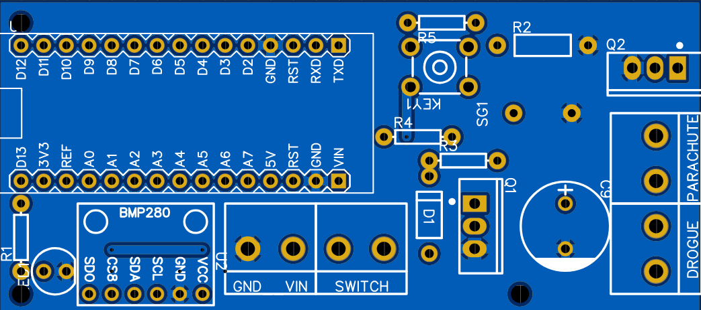

# rRocket 

rRocket é um projeto open-source de computador de bordo para minifoguetes baseado em Arduino visando a educação na área aeroespacial. 

# Características principais
- Capacidade de registro da componente vertical da trajetória na memória permanente (EEPROM) do Arduino;
- Capacidade de acionamento de dois paraquedas: o auxiliar (drogue) no apogeu e o principal em uma altura programável;
- Controle através do algoritmo de Máquina de Estados Finitos;
- Aplicação do filtro de Kalman para detecção de apogeu;
- Relatório de erros;
- Configuração, leitura de dados e simulação de voo através de interface gráfica dedicada (rRocket-UI).

# Versão
Versão 1.7.2

# Aviso
Como qualquer sistema eletrônico, o rRocket não é infalível. Deste modo, é fundamental que os usuários sigam rigorosamente as regras de segurança para lançamentos de minifoguetes. Além disso, é essencial garantir que, em caso de falha do sistema de recuperação, a queda do minifoguete não cause danos à vida ou ao patrimônio. Os autores se isentam de qualquer responsabilidade sobre a utilização do dispositivo.

# Hardware
Desenvolvido com o propósito de estímulo à educação aeroespacial e redução de custos, o hardware do rRocket é composto por uma placa de circuito impresso (PCI) pode ser adquirida diretamente pelo SITE e por componentes eletrônicos facilmente disponíveis no mercado. Em função disso, o computador de bordo pode ser montado por qualquer pessoa com conhecimento básico de soldagem. A figura abaixo ilustra 

Placa de circuito impresso (PCI) do rRocket.

# Software

# Testes de verificação e validação
